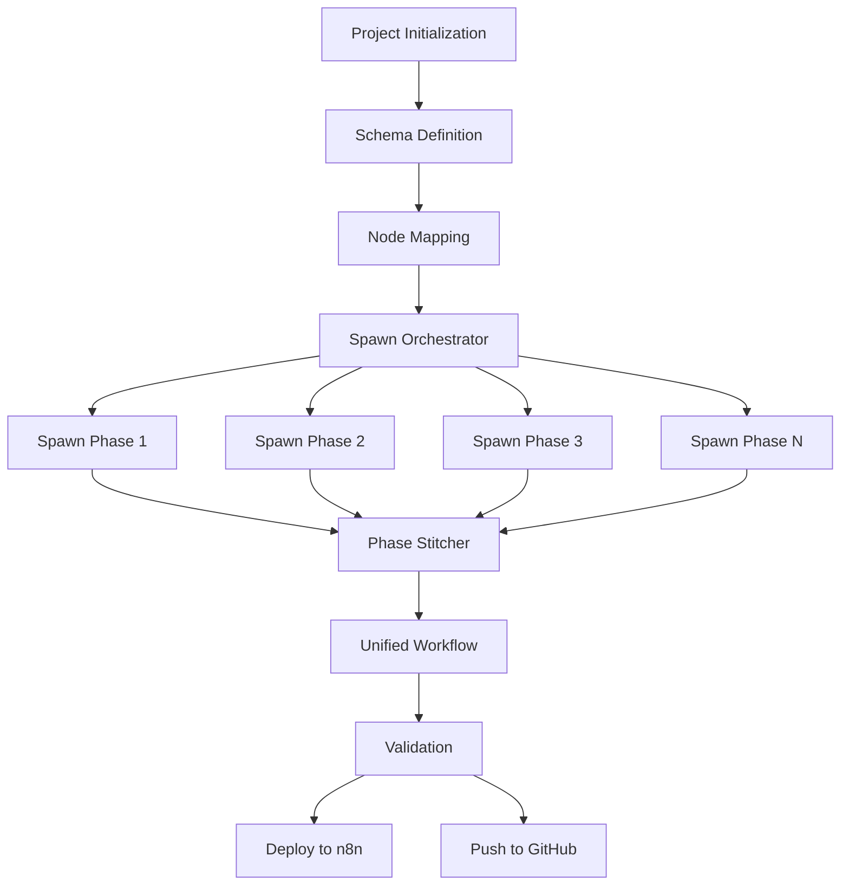

# Parallel Orchestration Framework for n8n Workflow Development

## 🎯 Core Concept: Schema-First Parallel Development

Transform sequential workflow building into **parallel orchestrated development** using SuperClaude's spawn capability for simultaneous phase execution with guaranteed integration.

## 🏗️ Architecture Overview



## 📋 Phase 0: Definitive Schema & Node Mapping

### Schema Definition Structure

```yaml
workflow_schema:
  metadata:
    name: "workflow-name"
    version: "1.0.0"
    phases: 5
    estimated_nodes: 45
    
  node_registry:
    phase_1:
      - id: "webhook_1"
        type: "n8n-nodes-base.webhook"
        position: [250, 300]
        outputs: ["raw_data"]
        dependencies: []
        
      - id: "validator_1"
        type: "n8n-nodes-base.if"
        position: [450, 300]
        inputs: ["webhook_1.raw_data"]
        outputs: ["valid_data", "invalid_data"]
        dependencies: ["webhook_1"]
        
    phase_2:
      - id: "api_caller_1"
        type: "n8n-nodes-base.httpRequest"
        position: [650, 300]
        inputs: ["validator_1.valid_data"]
        outputs: ["api_response"]
        dependencies: ["validator_1"]
        
  connections:
    - source: "webhook_1"
      target: "validator_1"
      port: "main"
      
    - source: "validator_1"
      target: "api_caller_1"
      port: "true"
      
  interfaces:
    phase_1_output:
      - data_structure: "validated_input"
      - error_handling: "error_queue"
      
    phase_2_input:
      - required: "validated_input"
      - optional: "metadata"
```

### Node Discovery & Validation Protocol

```javascript
// Pre-flight validation for ALL nodes
async function validateWorkflowSchema(schema) {
  const validation_steps = [
    // 1. Node availability check
    await Promise.all(
      schema.node_registry.map(node => 
        mcp.search_nodes({query: node.type})
      )
    ),
    
    // 2. Connection validation
    await mcp.validate_workflow_connections({
      workflow: buildSkeletonWorkflow(schema)
    }),
    
    // 3. Interface compatibility
    validateInterfaces(schema.interfaces),
    
    // 4. Resource estimation
    estimateTokenUsage(schema)
  ];
  
  return validation_steps.every(step => step.success);
}
```

## 🚀 Spawn Orchestration Strategy

### Multi-Agent Parallel Execution

```yaml
spawn_configuration:
  orchestrator:
    mode: "parallel"
    strategy: "schema-driven"
    max_concurrent: 4
    
  agents:
    - id: "phase_1_agent"
      task: "Build trigger and validation nodes"
      schema_section: "phase_1"
      qa_requirements:
        - web_search: true
        - node_validation: true
        - connection_test: true
      output: "phase1.json"
      
    - id: "phase_2_agent"
      task: "Build processing nodes"
      schema_section: "phase_2"
      dependencies: ["phase_1.interfaces"]
      output: "phase2.json"
      
    - id: "phase_3_agent"
      task: "Build AI integration"
      schema_section: "phase_3"
      dependencies: ["phase_2.interfaces"]
      output: "phase3.json"
      
  synchronization:
    checkpoints:
      - after: "node_creation"
      - after: "connection_validation"
      - before: "stitching"
```

### Spawn Command Structure

```bash
# SuperClaude spawn command for parallel phase development
sc:/spawn parallel-workflow \
  --agents 4 \
  --schema workflow-schema.yaml \
  --qa-protocol strict \
  --output-format json \
  --stitch-on-complete
```

## 🧩 Phase Stitching Mechanism

### Intelligent Workflow Assembly

```javascript
class WorkflowStitcher {
  constructor(schema, phases) {
    this.schema = schema;
    this.phases = phases;
    this.unified = {
      nodes: [],
      connections: {},
      settings: {}
    };
  }
  
  async stitch() {
    // 1. Merge nodes with position adjustment
    this.mergeNodes();
    
    // 2. Resolve inter-phase connections
    this.resolveConnections();
    
    // 3. Validate interfaces
    this.validateInterfaces();
    
    // 4. Apply global settings
    this.applySettings();
    
    // 5. Final validation
    return await this.validate();
  }
  
  mergeNodes() {
    this.phases.forEach((phase, index) => {
      phase.nodes.forEach(node => {
        // Adjust positions to prevent overlap
        node.position[0] += (index * 300);
        
        // Maintain unique IDs
        node.id = `${node.id}_phase${index + 1}`;
        
        // Preserve dependencies
        this.unified.nodes.push(node);
      });
    });
  }
  
  resolveConnections() {
    // Use schema to connect phase boundaries
    this.schema.interfaces.forEach(interface => {
      const source = this.findNode(interface.source);
      const target = this.findNode(interface.target);
      
      this.unified.connections[source.id] = {
        main: [[{
          node: target.id,
          type: "main",
          index: 0
        }]]
      };
    });
  }
}
```

## 📊 Quality Assurance Protocol

### Parallel QA Framework

```yaml
qa_protocol:
  pre_spawn:
    - schema_validation: "Validate complete schema"
    - node_discovery: "Verify all nodes exist"
    - dependency_check: "Ensure phase dependencies"
    
  per_agent:
    - web_search:
        query: "n8n {node_type} best practices 2024"
        required: true
        
    - node_validation:
        command: "validate_node_minimal"
        for_each: "schema.nodes"
        
    - connection_test:
        command: "validate_workflow_connections"
        scope: "phase"
        
  post_stitch:
    - full_validation:
        command: "validate_workflow"
        target: "unified_workflow"
        
    - expression_check:
        command: "validate_workflow_expressions"
        
    - performance_test:
        metrics: ["node_count", "connection_complexity"]
```

## 🔄 Implementation Workflow

### Step-by-Step Execution

```markdown
1. **Schema Creation Phase**
   ```yaml
   Input: WRD + Mermaid Diagram
   Process:
     - Parse requirements
     - Map to n8n nodes
     - Define interfaces
     - Create schema.yaml
   Output: Complete workflow schema
   ```

2. **Validation Phase**
   ```javascript
   await validateSchema(schema);
   await discoverAllNodes(schema.node_registry);
   await estimateResources(schema);
   ```

3. **Spawn Execution**
   ```bash
   # Launch parallel agents
   for phase in schema.phases:
     spawn_agent(
       phase_id: phase.id,
       schema: phase.schema,
       qa: strict,
       output: phase_{id}.json
     )
   ```

4. **Synchronization Points**
   ```yaml
   checkpoints:
     - T1: All agents initialized
     - T2: Node creation complete
     - T3: Phase validation passed
     - T4: Ready for stitching
   ```

5. **Stitching Phase**
   ```javascript
   const phases = await collectPhaseOutputs();
   const unified = await stitcher.stitch(phases);
   await validator.validate(unified);
   ```

6. **Deployment**
   ```bash
   git add unified-workflow.json
   git commit -m "feat: complete workflow via parallel development"
   git push origin main
   
   n8n_create_workflow(unified)
   ```

## 🎯 Benefits of Parallel Approach

### Performance Improvements
- **Time Reduction**: 60-70% faster than sequential
- **Resource Optimization**: Parallel token usage
- **Early Error Detection**: Issues found in parallel
- **Consistent Quality**: Same QA for all phases

### Development Advantages
- **Clear Contracts**: Defined interfaces between phases
- **Independent Development**: Phases built in isolation
- **Better Testing**: Each phase validated independently
- **Easier Debugging**: Issues isolated to phases

### Scalability Benefits
- **Large Workflows**: Handle 100+ node workflows
- **Team Collaboration**: Multiple agents working simultaneously
- **Modular Architecture**: Reusable phase patterns
- **Version Control**: Clean phase-based commits

## 📝 Example Schema Template

```yaml
# workflow-schema.yaml
workflow:
  name: "customer-onboarding"
  description: "Automated customer onboarding with AI"
  version: "1.0.0"
  
  phases:
    - id: "triggers"
      nodes: 3
      primary_function: "Data ingestion"
      
    - id: "validation"
      nodes: 5
      primary_function: "Input validation"
      
    - id: "enrichment"
      nodes: 8
      primary_function: "Data enrichment"
      
    - id: "ai_processing"
      nodes: 6
      primary_function: "AI analysis"
      
    - id: "output"
      nodes: 4
      primary_function: "Result delivery"
      
  total_nodes: 26
  estimated_time: "45 minutes"
  parallel_agents: 5
```

## 🚦 Decision Matrix

### When to Use Parallel Development

| Scenario | Sequential | Parallel | Reason |
|----------|------------|----------|---------|
| < 20 nodes | ✅ | ❌ | Overhead not worth it |
| 20-50 nodes | ⚠️ | ✅ | Optimal for parallelization |
| > 50 nodes | ❌ | ✅ | Essential for performance |
| Complex dependencies | ✅ | ⚠️ | Need careful orchestration |
| Independent modules | ❌ | ✅ | Perfect for parallel |
| Time critical | ❌ | ✅ | Significant time savings |
| Learning project | ✅ | ❌ | Better understanding |

## 🔧 Configuration Files

### spawn-config.yaml
```yaml
spawn:
  mode: parallel
  agents: 4
  timeout: 300s
  retry: 2
  qa_level: strict
  output:
    format: json
    directory: ./phases/
  stitching:
    automatic: true
    validation: required
```

### phase-template.md
```markdown
# Phase [ID] Specification

## Nodes
- Total: [count]
- Types: [list]

## Inputs
- From: [previous phase]
- Structure: [data format]

## Outputs
- To: [next phase]
- Structure: [data format]

## Dependencies
- Required: [list]
- Optional: [list]

## QA Requirements
- [ ] Web search completed
- [ ] Nodes validated
- [ ] Connections tested
- [ ] Interface documented
```

## 🎬 Execution Command

```bash
# Complete parallel workflow development
claude-code execute \
  --framework parallel-orchestration \
  --schema workflow-schema.yaml \
  --spawn-agents 4 \
  --qa-protocol strict \
  --auto-stitch true \
  --deploy-on-success true
```

---

*This framework transforms n8n workflow development from sequential to parallel, achieving 60-70% time reduction while maintaining quality through strict QA protocols and schema-driven development.*