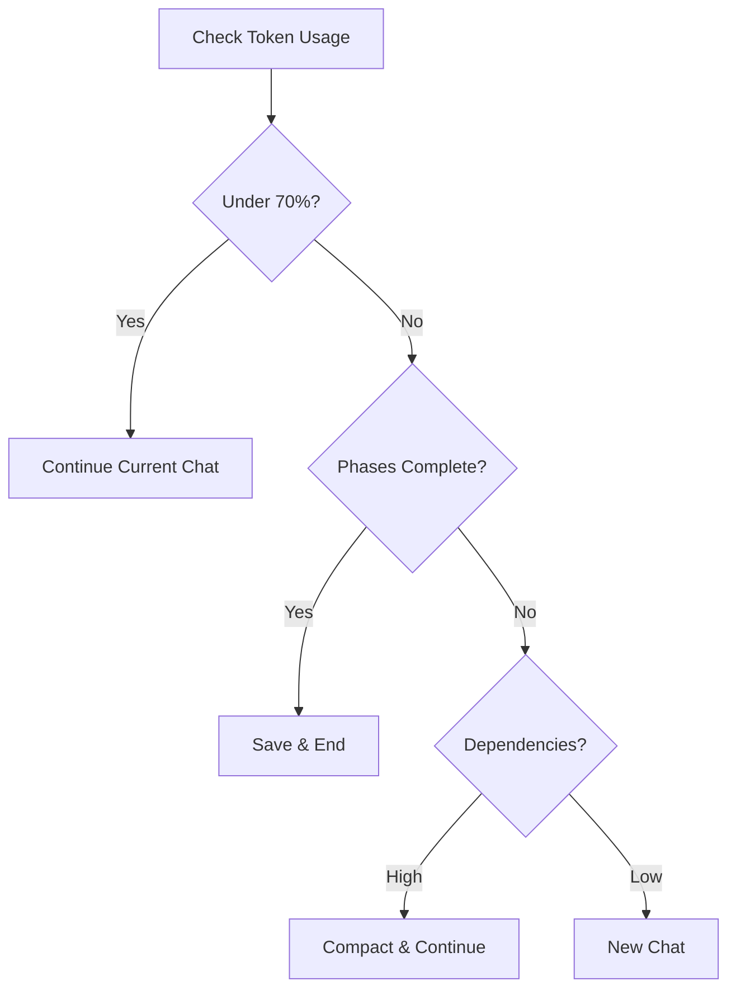

# 🎯 Quick Reference Card - Context Management

## 📊 Token Usage Indicators

```bash
# Visual Cues in Claude Code
🟢 0-50%    : Full speed ahead
🟡 50-70%   : Plan your exit
🟠 70-90%   : Execute handoff
🔴 90%+     : Emergency save
```

## 🚨 When You See These Signs → Take Action

| Warning Sign | Immediate Action |
|-------------|-----------------|
| Responses getting shorter | Check token usage |
| "I need to be concise" | Prepare handoff |
| Truncated outputs | Save and exit |
| Slower responses | Context overhead |

## 💬 Magic Phrases for Context Management

### To Check Status:
```
"What's our current context usage percentage?"
"How many phases can we complete in this chat?"
```

### To Optimize:
```
"Provide a compressed technical summary for handoff"
"Save current state and prepare for new chat"
```

### To Continue:
```
"Load [workflowID] and continue Phase [N]"
"Resume from handoff document: [paste]"
```

## 🔄 Quick Decision Tree



## 📝 5-Minute Handoff Template

```markdown
QUICK HANDOFF - [Project] Phase [N]
=====================================
Workflow: [ID]
GitHub: [last-commit]
Status: [what works]
Next: [immediate action]
Issues: [blockers]
Load: "Pull workflow [ID] from n8n"
=====================================
```

## 🎮 Keyboard Shortcuts (Mental Model)

- **Ctrl+S**: Save to GitHub
- **Ctrl+N**: New chat for phase
- **Ctrl+C**: Compact conversation  
- **Ctrl+H**: Generate handoff
- **Ctrl+R**: Resume from handoff

## 📈 Phase Sizing Guide

| Phase Complexity | Token Budget | Nodes | Strategy |
|-----------------|--------------|--------|----------|
| Simple | 10-20K | 5-10 | Batch multiple |
| Moderate | 20-40K | 10-15 | One per session |
| Complex | 40-60K | 15-20 | Dedicated chat |
| Critical | 60K+ | 20+ | Split into sub-phases |

## 🚀 Speed Run Commands

### Start Fresh Project:
```
"Initialize [project] with these docs: [paste all]"
```

### Continue Existing:
```
"Resume [project] Phase [N] from workflow [ID]"
```

### Emergency Save:
```
"Quick save all work and generate minimal handoff"
```

### Optimal Handoff:
```
"Create comprehensive handoff with configurations"
```

## ⚡ Token Saving Hacks

1. **Reference, Don't Repeat**
   - ❌ Paste workflow JSON again
   - ✅ "Load workflow [ID]"

2. **Batch Commands**
   - ❌ Multiple messages
   - ✅ Single message with numbered steps

3. **Use IDs**
   - ❌ "The webhook node we created"
   - ✅ "Node webhook_1"

4. **Compress Responses**
   - Add `--uc` flag for ultra-compressed mode
   - Request "concise technical summary"

## 🎯 Perfect First Message Template

```markdown
# Project: [Name]
# Phase: [N] of [Total]
# Objective: [One line]

## Documents (place first):
[WRD]
[Mermaid]
[Schemas]

## Request (place last):
"Initialize Phase [N] focusing on [specific goal]"
```

## 🔴 Red Flags = Stop Immediately

- Error: "Context length exceeded"
- Multiple failed validations
- Can't load previous work
- Responses cut off mid-sentence
- "I don't have access to previous..."

**Action**: Save, document, start fresh

---

*Print this card. Keep it visible. Use it every session.*