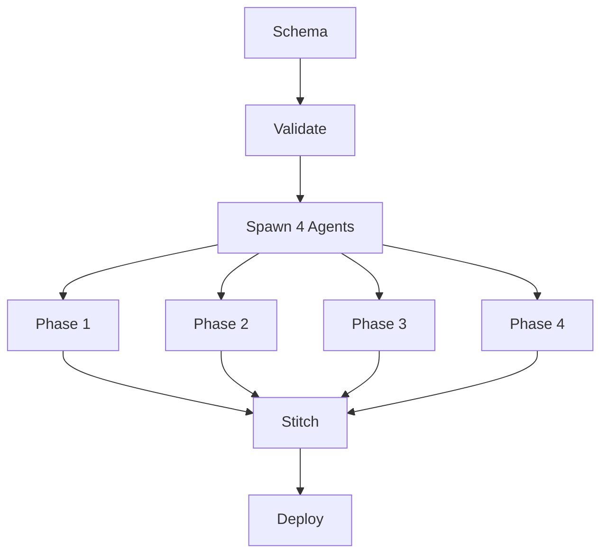

# Parallel Orchestration Framework

## Core Concept

Transform sequential workflow building into **parallel orchestrated development** using spawn capability for simultaneous phase execution with guaranteed integration.

## Architecture



## Spawn Configuration

```yaml
spawn:
  mode: parallel
  agents: 4
  timeout: 300s
  qa_level: strict
  
assignments:
  agent_1: ["triggers", "validation"]
  agent_2: ["processing", "transformation"]
  agent_3: ["ai_integration", "enrichment"]
  agent_4: ["output", "delivery"]
  
synchronization:
  - after: "node_creation"
  - after: "validation"
  - before: "stitching"
```

## Phase Stitching

The stitcher (`templates/phase-stitcher.js`) intelligently combines parallel outputs:

```javascript
// Stitching process
1. Collect all phase outputs
2. Merge nodes with position adjustment
3. Resolve inter-phase connections
4. Validate interfaces
5. Apply error handling
6. Generate unified workflow
```

### Stitching Rules

1. **Node IDs**: Append phase suffix to maintain uniqueness
2. **Positions**: Auto-adjust with 400px phase spacing
3. **Connections**: Use schema interfaces for phase boundaries
4. **Validation**: Ensure no orphan nodes or broken connections

## Parallel QA Protocol

### Pre-Spawn Validation
```javascript
// Execute before spawning agents
await validateSchema(schema)
await discoverAllNodes(schema.node_registry)
await estimateResources(schema)
```

### Per-Agent QA
```yaml
each_agent:
  - web_search: "n8n {node_type} patterns"
  - node_validation: validate_node_minimal()
  - connection_test: validate_connections()
  - interface_check: validate_interfaces()
```

### Post-Stitch Validation
```javascript
// After combining all phases
await validate_workflow(unified)
await validate_expressions(unified)
await test_execution(unified)
```

## Performance Metrics

| Metric | Sequential | Parallel | Improvement |
|--------|------------|----------|-------------|
| Time | 2 hours | 45 min | 62.5% faster |
| Tokens | 150K | 40K/agent | Distributed |
| Quality | Variable | Consistent | Uniform |
| Errors | Late detection | Early detection | Parallel |

## When to Use Parallel

### Ideal Scenarios
- ✅ 50+ nodes
- ✅ Complete specifications
- ✅ Modular architecture
- ✅ Time-critical delivery
- ✅ Production workflows
- ✅ Clear phase boundaries

### Avoid When
- ❌ Learning n8n
- ❌ <30 nodes
- ❌ Evolving requirements
- ❌ Complex dependencies
- ❌ Debugging existing
- ❌ Exploration/POC

## Commands

```bash
# Initialize parallel workflow
/wp init --schema schema.yaml

# Spawn agents
/wp spawn --agents 4 --qa strict

# Monitor progress
/wp status

# Stitch phases
/wp stitch --validate

# Deploy unified
/wp deploy --github --n8n
```

## Agent Specialization

### Agent Types
```yaml
trigger_specialist:
  focus: ["webhooks", "schedules", "events"]
  nodes: ["trigger", "poll", "watch"]
  
processor_specialist:
  focus: ["logic", "transformation", "routing"]
  nodes: ["if", "switch", "code", "merge"]
  
ai_specialist:
  focus: ["llm", "agents", "embeddings"]
  nodes: ["openai", "agent", "memory"]
  
integration_specialist:
  focus: ["apis", "databases", "services"]
  nodes: ["http", "postgres", "slack"]
```

## Synchronization Points

Critical checkpoints where agents coordinate:

1. **Schema Lock**: All agents receive same schema
2. **Node Creation**: Verify all nodes created
3. **Interface Validation**: Check phase boundaries
4. **Pre-Stitch**: Confirm ready for combination
5. **Post-Stitch**: Validate unified workflow

## Error Recovery

```yaml
error_strategies:
  agent_failure:
    action: "reassign_to_backup"
    timeout: 60s
    
  validation_failure:
    action: "fix_and_retry"
    max_retries: 3
    
  stitch_failure:
    action: "manual_intervention"
    fallback: "sequential_mode"
```

## Resource Allocation

```yaml
resources_per_agent:
  tokens: 50K
  memory: "512MB"
  timeout: "5min"
  
total_resources:
  tokens: 200K
  memory: "2GB"
  parallel_limit: 4
```

## Success Criteria

- ✅ All phases complete independently
- ✅ Interfaces validated
- ✅ Stitching successful
- ✅ Unified workflow validates
- ✅ Execution test passes
- ✅ Deployed to n8n

## Troubleshooting

| Issue | Cause | Solution |
|-------|-------|----------|
| Stitch fails | Interface mismatch | Review schema interfaces |
| Agent timeout | Complex phase | Increase timeout or split phase |
| Validation error | Missing node | Check node availability |
| Connection broken | ID mismatch | Verify node IDs in schema |

---

*Parallel orchestration: 60-70% faster development for large workflows.*