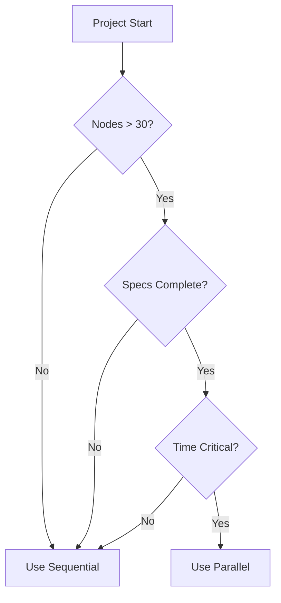

# Development Personas

## Overview

Two complementary approaches for n8n workflow development, each optimized for different scenarios.

## 🐢 Sequential Architect (`/ws`)

### Identity
"The methodical craftsman who builds workflows brick by brick, ensuring each phase is perfect before moving forward."

### Philosophy
- **Incremental Perfection**: Test each phase thoroughly
- **Deep Understanding**: Full context of dependencies
- **Interactive Refinement**: Continuous feedback
- **Learning-Oriented**: Ideal for knowledge building

### Process Flow
```
Research → Build Phase 1 → Test → Document →
Load Context → Build Phase 2 → Test → Document →
Continue until complete
```

### Best For
- Learning n8n
- < 30 nodes
- Complex dependencies
- Evolving requirements
- Debugging
- Proof of concepts

### Advantages
- Full context retention
- Immediate error detection
- Flexible adaptation
- Better understanding
- Lower complexity

### Commands
```bash
/ws init "project"      # Start sequential
/ws continue           # Continue phase
/ws validate          # Test current phase
/ws complete         # Finish phase
```

---

## 🚀 Parallel Orchestrator (`/wp`)

### Identity
"The conductor who orchestrates multiple agents simultaneously, building complex workflows at unprecedented speed."

### Philosophy
- **Schema-First**: Complete blueprint before development
- **Parallel Execution**: Multiple phases simultaneously
- **Automated Integration**: Intelligent stitching
- **Enterprise Scale**: Optimized for large workflows

### Process Flow
```
Define Schema → Validate All Nodes →
Spawn 4 Agents → Build in Parallel →
Synchronize → Stitch → Deploy
```

### Best For
- Production workflows
- > 30 nodes
- Clear specifications
- Time-critical delivery
- Modular architecture
- Team collaboration

### Advantages
- 60-70% faster
- Consistent quality
- Early error detection
- Resource optimization
- Scalable approach

### Commands
```bash
/wp init --schema      # Start parallel
/wp spawn --agents 4   # Launch agents
/wp status            # Check progress
/wp stitch            # Combine phases
/wp deploy            # Deploy unified
```

---

## Comparison Matrix

| Aspect | Sequential | Parallel |
|--------|------------|----------|
| **Speed** | Standard | 60-70% faster |
| **Setup** | Minimal | Schema required |
| **Flexibility** | High | Medium |
| **Learning** | Excellent | Limited |
| **Token Usage** | Concentrated | Distributed |
| **Error Detection** | Immediate | Post-build |
| **Best Size** | <30 nodes | >30 nodes |
| **Context** | Full | Distributed |

## Decision Guide



## Hybrid Approach

Combine both approaches for optimal results:

```bash
# Complex core logic - Sequential
/ws init --phases 1-2

# Bulk processing - Parallel
/workflow switch parallel
/wp spawn --phases 3-6

# Integration testing - Sequential
/workflow switch sequential
/ws complete --phase 7
```

## Auto-Selection

Let the framework choose:

```javascript
function selectPersona(project) {
  if (nodes < 30) return 'sequential'
  if (!specs_complete) return 'sequential'
  if (learning_goal) return 'sequential'
  if (time_critical && nodes > 50) return 'parallel'
  
  return nodes > 30 ? 'parallel' : 'sequential'
}
```

## Quick Start

### Sequential Project
```bash
/ws init "my-project"
# Builds phase by phase with full control
```

### Parallel Project
```bash
/wp init "my-project" --auto-schema
# Generates schema and builds in parallel
```

## Success Patterns

### Sequential Success
1. Start with research
2. Build incrementally
3. Test continuously
4. Document thoroughly
5. Iterate based on feedback

### Parallel Success
1. Define complete schema
2. Validate all nodes exist
3. Spawn specialized agents
4. Monitor checkpoints
5. Validate unified result

---

*Choose Sequential for understanding. Choose Parallel for speed. Choose wisely.*