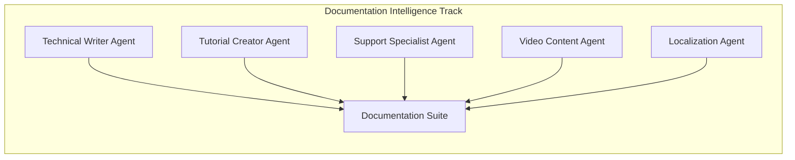
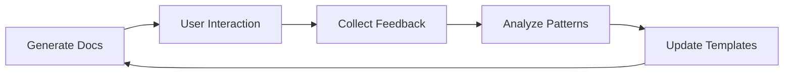

# Documentation Generation Suite

## Overview

The Documentation Intelligence Track ensures every generated workflow ships with comprehensive support materials. This isn't an afterthought - documentation is generated in parallel with the workflow itself, ensuring 100% coverage and accuracy.

## Documentation Philosophy

```
"A workflow without documentation is a liability.
A workflow with great documentation is an asset."
```

### Core Principles
1. **Parallel Generation**: Documentation created alongside workflow, not after
2. **Multi-Audience**: Different formats for developers, users, and stakeholders
3. **Living Documents**: Auto-updated with each workflow iteration
4. **Actionable Content**: Every document includes examples and next steps
5. **Visual Learning**: Diagrams, flowcharts, and video scripts included

## Documentation Intelligence Track

### Agent Composition


### Agent Specializations

#### Technical Writer Agent
```javascript
{
  "role": "Technical Documentation Specialist",
  "systemMessage": "You create clear, comprehensive technical documentation for n8n workflows. You understand both the technical implementation and business context.",
  "responsibilities": [
    "README.md generation",
    "API documentation",
    "Architecture diagrams",
    "Code comments"
  ],
  "tools": ["n8n-MCP", "Markdown generator", "Diagram creator"]
}
```

#### Tutorial Creator Agent
```javascript
{
  "role": "Educational Content Developer",
  "systemMessage": "You create step-by-step tutorials and guides that help users understand and implement workflows effectively.",
  "responsibilities": [
    "Implementation guides",
    "Quick start tutorials",
    "Best practices documentation",
    "Training materials"
  ],
  "tools": ["n8n-MCP", "Screenshot generator", "Example builder"]
}
```

#### Support Specialist Agent
```javascript
{
  "role": "Troubleshooting Expert",
  "systemMessage": "You anticipate common issues and create comprehensive troubleshooting guides and FAQs.",
  "responsibilities": [
    "Troubleshooting guides",
    "FAQ compilation",
    "Error code documentation",
    "Recovery procedures"
  ],
  "tools": ["Error pattern analyzer", "Solution database", "n8n-MCP"]
}
```

#### Video Content Agent
```javascript
{
  "role": "Visual Learning Specialist",
  "systemMessage": "You create scripts and storyboards for video tutorials and demonstrations.",
  "responsibilities": [
    "Video script writing",
    "Storyboard creation",
    "Demo scenarios",
    "Visual learning paths"
  ],
  "tools": ["Script generator", "Storyboard creator", "Demo builder"]
}
```

## Documentation Output Structure

### Complete Documentation Package
```
📁 project-name/
├── 📁 documentation/
│   ├── 📄 README.md                 # Overview and quick start
│   ├── 📄 IMPLEMENTATION.md         # Technical setup guide
│   ├── 📄 API.md                   # Integration documentation
│   ├── 📄 ARCHITECTURE.md          # System design and flow
│   ├── 📄 CONFIGURATION.md         # Settings and parameters
│   ├── 📄 TROUBLESHOOTING.md       # Common issues and solutions
│   ├── 📄 FAQ.md                   # Frequently asked questions
│   ├── 📄 CHANGELOG.md             # Version history
│   └── 📄 CONTRIBUTING.md          # Modification guidelines
├── 📁 code/
│   ├── 📄 workflow.json            # Deployable workflow
│   ├── 📄 workflow-pretty.json     # Human-readable version
│   ├── 📄 schema.yaml              # Structure definition
│   └── 📄 config.yaml              # Configuration file
├── 📁 testing/
│   ├── 📄 test-cases.json          # Test scenarios
│   ├── 📄 test-data.json           # Sample data
│   ├── 📄 validation.json          # Validation rules
│   └── 📄 metrics.json             # Performance baselines
├── 📁 examples/
│   ├── 📄 basic-usage.md           # Simple examples
│   ├── 📄 advanced-usage.md        # Complex scenarios
│   ├── 📄 integration-examples.md  # External integrations
│   └── 📄 edge-cases.md            # Unusual scenarios
├── 📁 media/
│   ├── 📄 video-script.md          # Tutorial video script
│   ├── 📄 presentation.md          # Slide deck content
│   ├── 🖼️ architecture-diagram.svg # Visual architecture
│   └── 🖼️ flow-diagram.svg        # Workflow visualization
└── 📁 localization/
    ├── 📄 README.es.md             # Spanish
    ├── 📄 README.fr.md             # French
    ├── 📄 README.de.md             # German
    └── 📄 README.zh.md             # Chinese
```

## Document Templates

### README.md Template
```markdown
# [Workflow Name]

## Overview
[Brief description of what this workflow does and its business value]

## Features
- ✅ [Feature 1]
- ✅ [Feature 2]
- ✅ [Feature 3]

## Quick Start
1. Import `workflow.json` into n8n
2. Configure credentials
3. Set environment variables
4. Activate workflow
5. Test with sample data

## Requirements
- n8n version: 1.0.0+
- Required nodes: [list]
- External services: [list]
- API keys needed: [list]

## Architecture
[Mermaid diagram of workflow]

## Configuration
See [CONFIGURATION.md](./CONFIGURATION.md) for detailed settings.

## Troubleshooting
See [TROUBLESHOOTING.md](./TROUBLESHOOTING.md) for common issues.

## Performance
- Processing speed: X items/minute
- Memory usage: X MB
- API calls: X per execution

## Support
- Documentation: [link]
- Community: [link]
- Issues: [link]

## License
[License information]

---
Generated by n8n Multi-Agent Workflow Builder v2.0
```

### IMPLEMENTATION.md Template
```markdown
# Implementation Guide

## Prerequisites
- [ ] n8n instance running
- [ ] Required credentials configured
- [ ] Environment variables set
- [ ] Dependencies installed

## Step-by-Step Setup

### 1. Import Workflow
```bash
# Via UI
1. Open n8n interface
2. Click "Import from File"
3. Select workflow.json
4. Click "Import"

# Via CLI
n8n import:workflow --input=workflow.json
```

### 2. Configure Credentials
[Detailed credential setup for each service]

### 3. Environment Variables
```bash
export N8N_API_URL=your-url
export API_KEY=your-key
```

### 4. Test Execution
[Step-by-step testing procedure]

### 5. Production Deployment
[Production deployment checklist]

## Advanced Configuration
[Complex setup options]

## Integration Examples
[Code examples for external integrations]

## Monitoring Setup
[How to monitor workflow performance]
```

### TROUBLESHOOTING.md Template
```markdown
# Troubleshooting Guide

## Common Issues

### Issue: Workflow fails to activate
**Symptoms**: Error message when activating
**Cause**: Missing credentials or permissions
**Solution**:
1. Check all credentials are configured
2. Verify API permissions
3. Review error logs
4. Test in manual mode first

### Issue: Poor performance
**Symptoms**: Slow execution, timeouts
**Cause**: Resource constraints or inefficient logic
**Solution**:
1. Check server resources
2. Optimize node configuration
3. Implement batching
4. Add caching where appropriate

## Error Codes
| Code | Description | Solution |
|------|------------|----------|
| E001 | Authentication failed | Check credentials |
| E002 | Rate limit exceeded | Implement throttling |
| E003 | Invalid data format | Validate input schema |

## Debug Mode
Enable debug logging:
```bash
export N8N_LOG_LEVEL=debug
```

## Getting Help
1. Check FAQ.md
2. Search community forum
3. Create GitHub issue
4. Contact support
```

## Documentation Generation Process

### Phase 1: Content Extraction
```javascript
function extractWorkflowMetadata(workflow) {
  return {
    name: workflow.name,
    description: workflow.description,
    nodes: workflow.nodes.map(node => ({
      type: node.type,
      purpose: analyzePurpose(node),
      configuration: extractConfig(node)
    })),
    connections: analyzeDataFlow(workflow.connections),
    complexity: calculateComplexity(workflow),
    requirements: identifyRequirements(workflow)
  };
}
```

### Phase 2: Documentation Assembly
```javascript
async function generateDocumentation(metadata) {
  const docs = {
    readme: await generateReadme(metadata),
    implementation: await generateImplementation(metadata),
    api: await generateAPI(metadata),
    troubleshooting: await generateTroubleshooting(metadata),
    examples: await generateExamples(metadata),
    videoScript: await generateVideoScript(metadata)
  };
  
  return formatDocumentation(docs);
}
```

### Phase 3: Quality Validation
```javascript
function validateDocumentation(docs) {
  const checks = {
    completeness: checkAllSectionsPresent(docs),
    accuracy: verifyAgainstWorkflow(docs),
    readability: assessReadability(docs),
    examples: validateExamples(docs),
    links: checkAllLinks(docs)
  };
  
  return checks.all(check => check.passed);
}
```

## Video Script Generation

### Script Structure
```markdown
# Video Tutorial Script: [Workflow Name]

## Introduction (0:00-0:30)
- Hook: [Problem statement]
- Value proposition: [What viewers will learn]
- Prerequisites: [What they need]

## Overview (0:30-1:30)
- Workflow purpose
- Key features demonstration
- Expected outcomes

## Implementation (1:30-5:00)
### Step 1: Import Workflow
[Screen recording instructions]

### Step 2: Configure Settings
[Configuration walkthrough]

### Step 3: Test Execution
[Testing demonstration]

## Advanced Features (5:00-7:00)
- Customization options
- Performance optimization
- Integration possibilities

## Conclusion (7:00-7:30)
- Recap key points
- Next steps
- Additional resources

## Call to Action
- Subscribe for more tutorials
- Join community
- Share feedback
```

## Localization Strategy

### Supported Languages
- English (primary)
- Spanish
- French
- German
- Portuguese
- Italian
- Japanese
- Chinese
- Korean
- Russian

### Localization Process
1. Generate primary documentation in English
2. Extract translatable content
3. Apply localization rules
4. Validate technical terms
5. Review by native speakers

### Localization Example
```javascript
const localizations = {
  en: {
    quickStart: "Quick Start",
    requirements: "Requirements",
    troubleshooting: "Troubleshooting"
  },
  es: {
    quickStart: "Inicio Rápido",
    requirements: "Requisitos",
    troubleshooting: "Solución de Problemas"
  },
  fr: {
    quickStart: "Démarrage Rapide",
    requirements: "Exigences",
    troubleshooting: "Dépannage"
  }
};
```

## Documentation Metrics

### Quality Metrics
- **Coverage**: 100% of nodes documented
- **Clarity**: Flesch readability score > 60
- **Completeness**: All required sections present
- **Accuracy**: Validated against actual workflow
- **Usefulness**: User feedback score > 4.5/5

### Generation Metrics
- **Speed**: <30 seconds for complete suite
- **Languages**: 10 localizations available
- **Formats**: Markdown, JSON, YAML
- **Examples**: Minimum 5 per workflow
- **Visuals**: At least 2 diagrams

## Continuous Improvement

### Feedback Loop


### Learning Patterns
1. Common user questions → FAQ updates
2. Frequent errors → Troubleshooting expansion
3. Setup difficulties → Implementation clarification
4. Performance issues → Optimization guides
5. Integration requests → Example additions

## Documentation Commands

### Generate Documentation
```bash
/wp docs generate --workflow workflow.json --complete
```

### Update Documentation
```bash
/wp docs update --section troubleshooting --feedback user-reports.json
```

### Localize Documentation
```bash
/wp docs localize --languages es,fr,de --source README.md
```

### Validate Documentation
```bash
/wp docs validate --check all --fix true
```

### Export Documentation
```bash
/wp docs export --format pdf --include all
```

## Best Practices

### Writing Style
- **Clear**: Simple language, avoid jargon
- **Concise**: Get to the point quickly
- **Consistent**: Use same terminology throughout
- **Complete**: Cover all use cases
- **Current**: Keep updated with workflow changes

### Visual Elements
- Use diagrams for complex flows
- Include screenshots for UI steps
- Add code examples for integrations
- Create tables for reference data
- Embed videos for tutorials

### User Focus
- Start with quick wins
- Progress from simple to complex
- Provide escape hatches for problems
- Include real-world examples
- Anticipate common questions

## Conclusion

The Documentation Generation Suite ensures that every workflow is not just functional but also understandable, maintainable, and scalable. By generating comprehensive documentation in parallel with workflow creation, we eliminate the documentation debt that plagues most automation projects.

The result is a complete package that enables anyone - from developers to business users - to understand, implement, and maintain the workflow successfully.