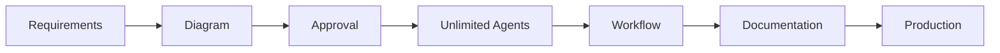

# Claude Instructions for n8n Multi-Agent Workflow Factory

## Quick Start

Build unlimited parallel AI agent workflows using n8n-MCP integration:

```bash
# Initialize workflow factory
npm install n8n-nodes-mcp
export N8N_COMMUNITY_PACKAGES_ALLOW_TOOL_USAGE=true

# Use n8n-MCP tools
mcp__n8n-mcp__search_nodes({query: "webhook"})
mcp__n8n-mcp__get_node_essentials({nodeType: "nodes-base.webhook"})
mcp__n8n-mcp__validate_workflow({workflow: workflowJson})
```

## Critical Understanding

### n8n-MCP Integration
- **NOT REST API**: n8n-nodes-mcp is an AI Agent subtool within n8n
- **HTTP URL**: Points to czlonkowski's n8n-MCP server
- **In AI Agent**: Configure as tool with HTTP operation
- **Reference**: Workflow ID dRQnnIfZZmxULitN shows structure

### Schema-First Development

**MANDATORY**: Every workflow MUST have complete parameter definitions:

```yaml
node_parameters:
  webhook:
    path: "string"          # Required
    method: "POST"          # Required
    responseMode: "onReceived"  # Required for parallel
  
  ai_agent:
    prompt: "string"        # Required
    outputParser:           # Required for structured output
      type: "structuredOutput"
      schema: {...}         # Full JSON schema
    tools:                  # Required for MCP
      - type: "n8n-nodes-mcp"
        parameters:
          url: "https://github.com/czlonkowski/n8n-mcp"
          operation: "HTTP"
          method: "POST"
```

**Why**: Parallel agents work independently. Without complete parameters, agents block waiting for information.

## Core Architecture

### 1. Pipeline Phases



### 2. Agent Intelligence Tracks

Each agent specializes with complete parameter knowledge:

- **Research Track**: Market analysis, patterns (needs: search parameters)
- **Technical Track**: Node selection (needs: node type parameters)
- **Validation Track**: Quality gates (needs: validation schemas)
- **Documentation Track**: Guides (needs: output formats)
- **Testing Track**: Test cases (needs: test parameters)
- **Integration Track**: APIs (needs: connection parameters)
- **Optimization Track**: Performance (needs: resource limits)
- **Scalability Track**: Load handling (needs: scaling parameters)

### 3. Convergence Algorithm

```javascript
// Weighted voting across agent outputs
consensus = {
  technical: weight * 0.3,
  validation: weight * 0.25,
  optimization: weight * 0.2,
  documentation: weight * 0.15,
  testing: weight * 0.1
}
```

## Development Workflow

### Phase 1: Research & Discovery

**ALWAYS START HERE** - Never skip discovery:

```javascript
// 1. Search for nodes
mcp__n8n-mcp__search_nodes({query: "webhook"})

// 2. Get parameters
mcp__n8n-mcp__get_node_essentials({
  nodeType: "nodes-base.webhook"
})

// 3. Validate minimal config
mcp__n8n-mcp__validate_node_minimal({
  nodeType: "nodes-base.webhook",
  config: {path: "/test", method: "POST"}
})
```

### Phase 2: Schema Creation

**COMPLETE PARAMETERS REQUIRED**:

```yaml
nodes:
  - id: "webhook_1"
    type: "n8n-nodes-base.webhook"
    parameters:           # ALL required fields
      path: "/webhook"
      method: "POST"
      responseMode: "onReceived"
    outputs:             # Define output structure
      - name: "main"
        type: "object"
        schema: {...}
    connections:         # Specify ports
      output: "main"
```

### Phase 3: Agent Configuration

```yaml
ai_agents:
  technical:
    systemMessage: "You are a technical specialist..."
    tools:
      - type: "n8n-nodes-mcp"
        parameters:
          url: "https://github.com/czlonkowski/n8n-mcp"
          operation: "HTTP"
          method: "POST"
          body:
            operation: "search_nodes"
    outputParser:
      type: "structuredOutput"
      schema:
        type: "object"
        properties:
          nodes: {type: "array"}
          confidence: {type: "number"}
```

### Phase 4: Validation

```javascript
// Full workflow validation
mcp__n8n-mcp__validate_workflow({
  workflow: completeWorkflowJson,
  options: {
    validateNodes: true,
    validateConnections: true,
    validateExpressions: true
  }
})
```

## Parameter Reference

### Essential Node Parameters

See `PARAMETERS.md` for complete reference. Critical examples:

**AI Agent**:
- prompt, systemMessage, temperature, maxTokens
- tools array with full configurations
- outputParser with complete schema
- credentials object

**Webhook**:
- path, method, responseMode
- responseHeaders, authentication
- options for binary/raw handling

**HTTP Request**:
- url, method, authentication
- headers, query, body parameters
- timeout, retry settings

**Merge**:
- mode (append|combine|mergeByKey)
- includeUnpaired, clashHandling
- mergeByKey configuration

### Output Structures

Every node MUST define outputs:

```yaml
outputs:
  main:
    - type: "object|array"
      schema:
        type: "object"
        properties:
          result: {type: "string"}
          confidence: {type: "number"}
```

### Connection Ports

Specify all connections:

```yaml
connections:
  - source:
      node: "node_id"
      output: "main"    # or "true"/"false" for IF nodes
    target:
      node: "target_id"
      input: "main"
```

## Quality Requirements

### Validation Gates
1. Node discovery completed
2. Parameters fully defined
3. Connections validated
4. Expressions checked
5. Workflow tested

### Success Metrics
- 98% syntax accuracy
- 95% deployment success
- 100% documentation coverage
- <2min for 100+ node workflows

## Common Patterns

### Parallel Agent Spawn

```yaml
# After Telegram approval
parallel_agents:
  - research_agent → search patterns
  - technical_agent → select nodes
  - validation_agent → check quality
  - documentation_agent → create guides
  
# All agents have complete parameters
# No blocking, no waiting
```

### Error Recovery

```yaml
error_handling:
  node_failure:
    retry: 3
    fallback: alternative_node
  agent_timeout:
    max_wait: 30s
    action: proceed_with_partial
```

## MCP Tool Usage

### Discovery Tools
```javascript
mcp__n8n-mcp__list_nodes({limit: 200})
mcp__n8n-mcp__search_nodes({query: "database"})
mcp__n8n-mcp__get_node_documentation({nodeType: "nodes-base.postgres"})
```

### Validation Tools
```javascript
mcp__n8n-mcp__validate_node_minimal({nodeType, config})
mcp__n8n-mcp__validate_workflow({workflow})
mcp__n8n-mcp__validate_workflow_connections({workflow})
```

### Template Tools
```javascript
mcp__n8n-mcp__list_templates({nodeTypes: ["n8n-nodes-base.webhook"]})
mcp__n8n-mcp__get_template({templateId: 123})
```

## Critical Rules

1. **NEVER** skip parameter definition - agents need complete info
2. **ALWAYS** validate before building - use MCP validation tools
3. **DEFINE** all outputs - downstream nodes need structure
4. **SPECIFY** all connections - ports must be explicit
5. **TEST** with minimal config first - then expand

## Performance Optimization

### Token Management
- Cache MCP responses within session
- Reuse discovered patterns
- Batch similar operations

### Parallel Execution
- Spawn all research agents simultaneously
- Process independent tracks in parallel
- Converge only at merge points

### Resource Limits
```yaml
agent_limits:
  max_iterations: 20
  timeout: 30s
  token_budget: 10000
  parallel_agents: unlimited  # System handles scheduling
```

## Troubleshooting

### Agent Blocking
**Symptom**: Agent waiting for information
**Cause**: Missing parameters in schema
**Fix**: Add complete parameter definitions

### Validation Failures
**Symptom**: Workflow won't deploy
**Cause**: Invalid node configuration
**Fix**: Use validate_node_minimal first

### Performance Issues
**Symptom**: Slow workflow generation
**Cause**: Sequential agent execution
**Fix**: Ensure parallel spawning after approval

## Reference Implementation

See `SCHEMA-COMPLETE.yaml` for production-ready schema with:
- 600+ lines of complete definitions
- All node parameters
- Output structures
- Connection mappings
- Error handling
- Resource estimates

---

**Remember**: This is an autonomous workflow factory. Give agents everything they need upfront through complete parameter definitions. No agent should ever wait for information.